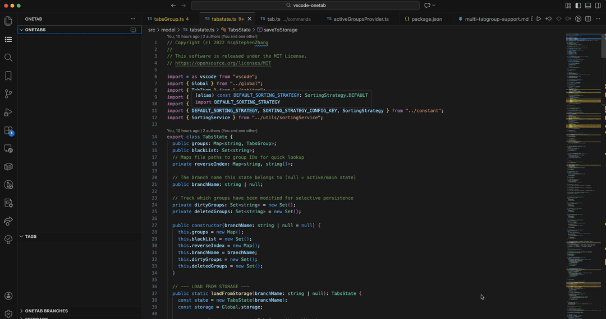
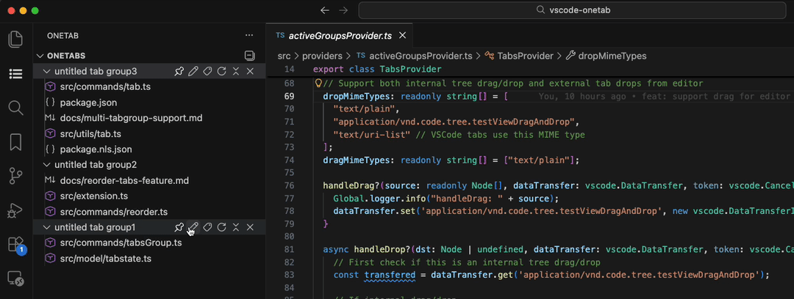
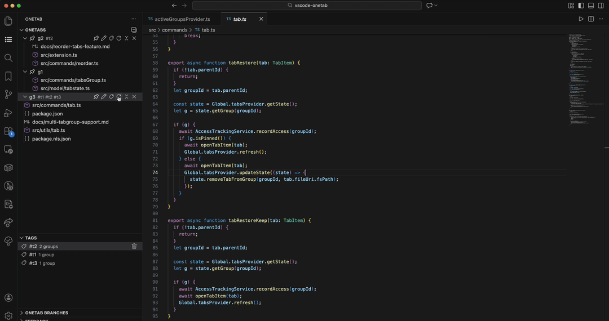
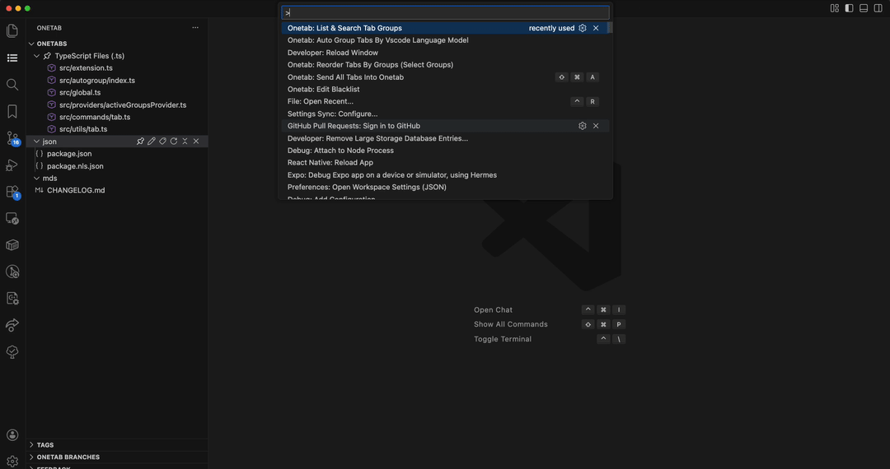
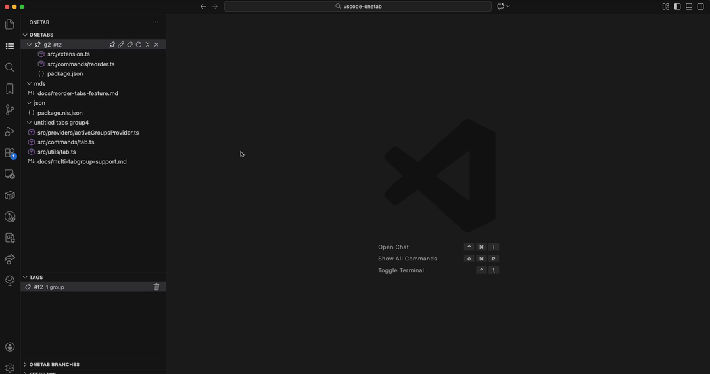
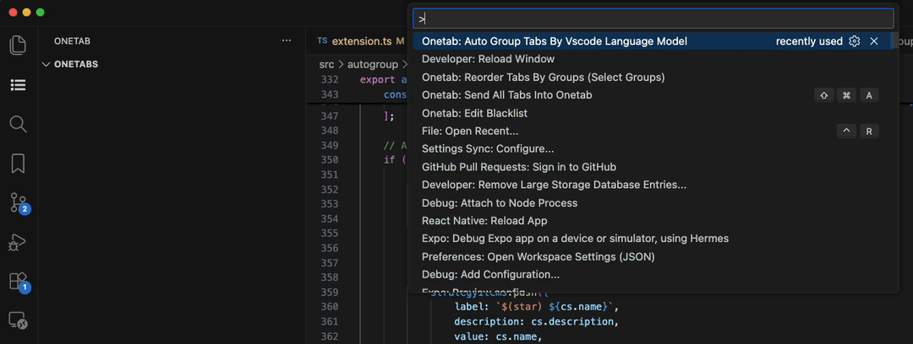

# Better OneTab for VS Code

> Powerful tab management for VS Code - Save, organize, and restore your editor tabs with smart grouping, Git branch tracking, and AI-powered auto-categorization

Inspired by the popular [OneTab](https://chrome.google.com/webstore/detail/onetab/chphlpgkkbolifaimnlloiipkdnihall) browser extension, this VS Code extension helps you manage dozens of open files efficiently.

## Features

### Core Tab Management
- **Save & Restore Tabs** - Quickly save individual tabs, multiple tabs, or entire groups
- **Restore Options** - Choose to restore tabs with or without removing them from groups
- **Smart Removal** - Remove tabs with automatic pin status detection and optional force remove with confirmation
- **Context Menu Integration** - All commands accessible via right-click on tree view items
- **Drag & Drop** - Reorganize tabs and groups with intuitive drag-and-drop interface
- **Reorder Tabs** - Reorganize tabs within groups or reorder multiple groups at once

### Organization & Management
- **Tag System** - Tag groups with multiple tags, filter by tags, and manage tags across all groups
- **Rename Groups** - Give meaningful names to your tab groups
- **Pin Groups** - Pin important groups to prevent accidental removal
- **Collapse Groups** - Close all open tabs belonging to a specific group with one click
-  **Search & Filter** - Find tab groups by name or tags with powerful search functionality
- **Blacklist Support** - Exclude specific files or patterns from being saved

### Smart Features
- **AI-Powered Auto-Grouping** - Automatically categorize tabs using Claude API
  - Group by directory hierarchy
  - Group by file extension
  - Group by file name patterns
  - Mix multiple strategies
  - Custom user-defined strategies
- **Git Branch Tracking** - Automatically track and restore tab state per Git branch
  - Save state when switching branches
  - Restore state when returning to a branch
  - Migrate tab state between branches
  - Browse and restore from non-active branches
- **Import/Export** - Backup and restore your entire tab database

### Advanced Sorting
- **Multiple Sorting Strategies** - Choose from:
  - **Default**: Pinned first, named, tagged, then by creation time
  - **LRU** (Least Recently Used): Recently accessed groups first
  - **LFU** (Least Frequently Used): Frequently accessed groups first

## Requirements

- VS Code 1.90.0 or higher
- Git extension (built-in) for branch tracking features

## Usage

### Send tab(s) to onetab extension in right click context

### Rename, pin, set tags, remove or restore tab groups in onetab extension

### Send tab(s) into specific tab group

### Restore or remove tab from tab group

### List and search tab group by their name or tags

### Drag and drop the tab group or tabs

### Auto group by large language model's API

There are three strategies for auto-grouping:
1. **dir** - Files' directory hierarchy
2. **ext** - File extension type (`.rs`, `.js`, etc.)
3. **filename** - File names

The UI supports a mix of multiple strategies, but single strategy's effect is the best.

**Notice**: We only support Claude API now (since it's entirely free), and you need to edit the API key in `settings.json`. Welcome to contribute and add support for other LLM APIs and our prompts!

### Track the Git branch switch and initialization

This feature will track the Git branch's switch and change the active tree view accordingly.

When you switch to a new branch, the active tree view will be clear, and the previous branch's state will be saved in the **readonly** tree view "ONETAB BRANCHES". If you switch to a branch that existed before, the original state will be restored.

You can also migrate the tab's state from one branch to the current branch.

## Configuration

You can configure the extension in VS Code settings:

- **API Key**: Set your Claude API key for AI auto-grouping
- **Blacklist**: Manage files to exclude from OneTab
- **Sorting Strategy**: Choose default sorting strategy for auto-grouping

## Changelog

See [CHANGELOG.md](CHANGELOG.md) for release notes and version history.

## [&] Contributing

Contributions are welcome! Please feel free to submit a Pull Request.

## License

[MIT](LICENSE) © hsqStephenZhang

## Issues

Found a bug or have a feature request? Please [open an issue](https://github.com/hsqStephenZhang/vscode-onetab/issues) on GitHub.

