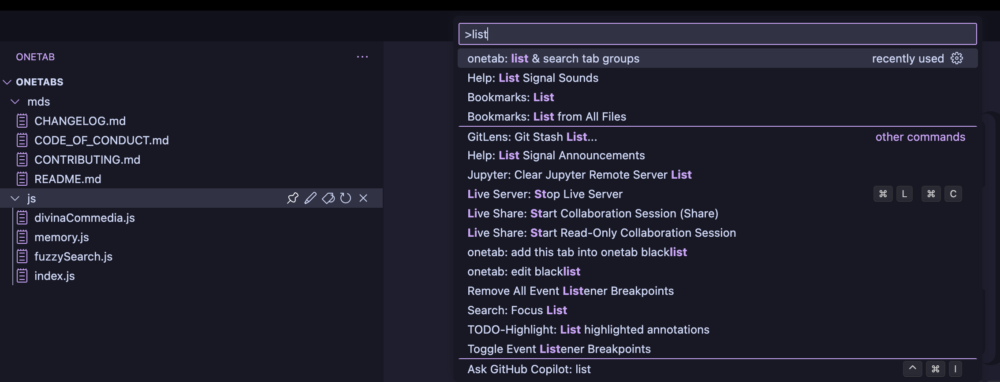

# vscode-onetabs README

## 1. what's this project

[onetab](https://chrome.google.com/webstore/detail/onetab/chphlpgkkbolifaimnlloiipkdnihall) for vscode

The reason for why you need this extension comes from this convenience.

When dealing with large projects, and working on multiple tasks, you may open dozens of files
in tab windows, and you may get lost in these tabs. Don't worry, this extension will save you from that dilemma.

## 2. usage

### send tab(s) to onetab extension in right click context.

### Rename, pin, set tags, remove or restore tab groups in onetab extension

### Send tab(s) into specific tab group

### restore or remove tab from tab group

### send file into blacklist and edit blacklist in configuration

you can send one file 

### list and search tab group by their name or tags

### drag and drop the tab group or tabs

### auto group by large language model's api

there are three strategies for autogroup:
1. dir: the files' directory hierarchy
2. ext: file's extension type, `.rs`, `.js` .etc
3. filename: file names

The UI supports mix of multiple strategies, but single strategy's effect is the best.

**Notice**: we only support claude api now(since it's entirely free), and you need to edit the api key in `settings.json`, welcome to contribute and add support of other LLM's api and our prompts

### track the git branch switch and initialization

This feature will track te git branch's switch and change the active treeview accordingly.

When you switch to a new branch, the active treeview will be clearly, the previous branch's state will be saved in the **readonly** treeview "ONETAB BRANCHES"; but if you switch to a branch that exists before, the original state will be restored.

You can also migrate the tab's state from one branch to the current branch.

## 3. todos

For users:

1. optimize icons, (might)use the current theme's icons
2. use copilot api to autogroup with the user given/default prompt

For Developers:

1. refactor the serialize/deserialize code, make it more readable
2. github action to auto package the `better-vscode-onetab.vsix` file

